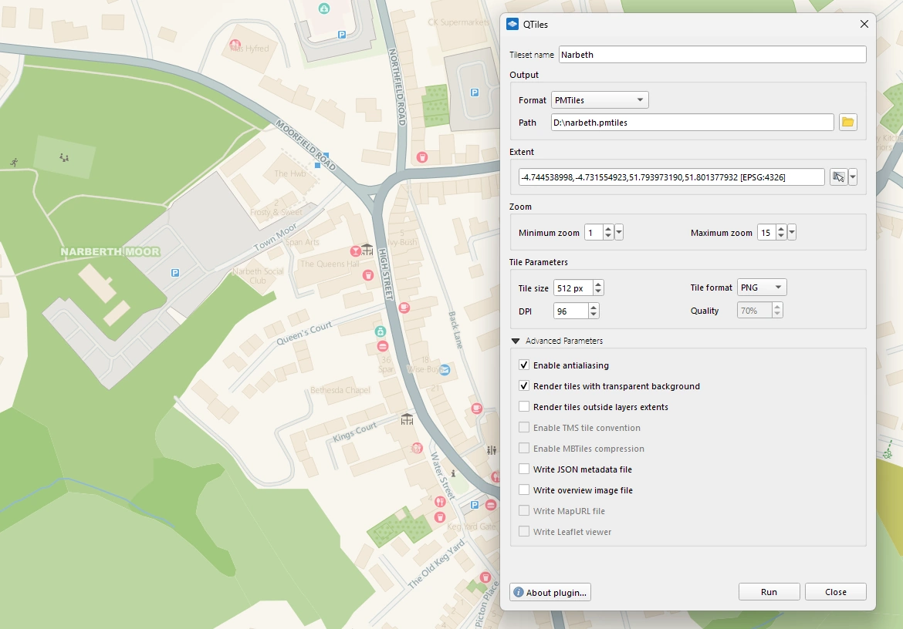
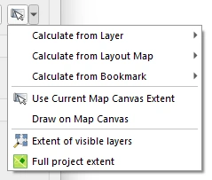
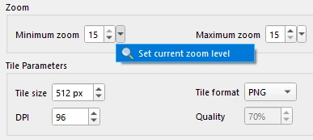

# QTiles

**QTiles** is a QGIS plugin that generates raster tile pyramids directly from QGIS projects while preserving QGIS styling.

The plugin renders map layers exactly as they appear in QGIS and exports them as raster tiles suitable for web maps, mobile GIS applications, and offline basemaps.

QTiles is widely used for preparing basemaps and tile packages for web mapping frameworks, mobile GIS, and static map deployments.

## Table of Contents

- [Features](#features)
- [Why QTiles](#why-qtiles)
- [Installation](#installation)
- [Usage](#usage)
- [Documentation](#documentation)
- [Community](#community)
- [Commercial support](#commercial-support)
- [License](#license)

## Features

* Generate raster tiles directly from QGIS projects
* Preserve full QGIS cartographic styling
* Create multi-zoom tile pyramids
* Export tiles in several widely used formats
* Generate tiles for web maps, mobile apps, and offline datasets
* Automatically create a simple Leaflet web viewer

QTiles can generate:
* Directory of tiles (XYZ/TMS folder structure)
* MBTiles
* PMTiles
* NextGIS Mobile-ready tilesets

## Why QTiles

When publishing maps on the web or preparing offline basemaps, raster tiles are one of the most widely used formats.

Creating tile pyramids usually requires additional server software or specialized tools. QTiles simplifies this workflow by allowing users to generate tiles directly from a QGIS project.

Key advantages:
* No additional server required
* Tiles reflect the exact cartography defined in QGIS
* Suitable for both online and offline map distribution
* Simple workflow integrated directly into QGIS
* Extended toolset to manage extent

* Extended toolset to manage zoom levels

## Installation

The easiest way to install the plugin is through the QGIS Plugin Manager.

1. Open **Plugins → Manage and Install Plugins**
2. Search for **QTiles**
3. Click **Install Plugin**

After installation the plugin will appear in the **Raster** menu and toolbar.

## Usage

1. Prepare and style your map in QGIS
2. Open QTiles
3. Choose the output format and path
4. Select zoom levels
5. Define the map extent
6. Start tile generation

QTiles will render the project and generate the tile pyramid.

## Documentation

📘 [Qtiles documentation](https://docs.nextgis.com/docs_ngqgis/source/qtiles.html#qtiles)

🎥 [Video](https://www.youtube.com/watch?v=vU4bGCh5khM)

## Community

💬 [Community forum](https://community.nextgis.com)

## Commercial support

Professional support, enterprise GIS solutions, and consulting services are available from the NextGIS team.

🌍 [NextGIS Website](https://nextgis.com)  

✉️ [Contact us](https://nextgis.com/contact/)

## License

This project is licensed under the **GNU General Public License v2 or later (GPL v2+)**.
